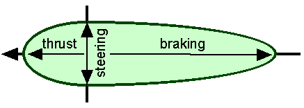

# Boids

**Platform:** Unity3D  
**Language:** C#

[](https://www.youtube.com/watch?v=_CTzKiVTFPQ&list=PLhahKzTuohKuUqbSX4nGUWwz7sa_EsgnZ&index=9&t=0s)

## Introduction

This is an overview of the boids algorithm as described in the [1999 Siggraph](http://www.red3d.com/cwr/papers/1999/gdc99steer.html)
paper written by Craig Reynolds with some input from a post at [www.kfish.org](http://www.kfish.org/boids/pseudocode.html). 
In his paper, Reynolds describes three levels of control used to create "autonomous characters" and simulate their
movements within a flock of birds or school of fish. These techniques have been used in countless movies, animations and
video games.  The levels of control can be broken down like this:

- **action selection** (highest)
- **steering** (middle)
- **locomotion** (lowest)

The *action selection* layer would involve strategies, goal selection and planning, while the lowest level, *locomotion*,
only involves the underlying animation mechanics.  Think about how a vehicle's animation layer would be handled quite differently than a
bipedal creature, for instance, which would be driving a skeleton. The locomotion layer would deal with how that is implemented.
For this project we are going to be focusing entirely on the middle layer; *steering behaviors* or "path determination". But first, let's
talk about our boid.

#### The Mighty Boid



Our boid is an object with three properties: a position, a velocity (where it is heading and how fast) and a list of
its neighbors within some distance.  The image above shows how vectors pushing in different directions would affect our
boid when applied. A vector pushing forward would cause our boid to speed up or maintain a certain velocity. While a
force pushing it left or right would cause it to veer in another direction.

On every single frame, we will calculate each boid's new position and velocity by applying our steering behaviors to get
a new velocity, then adding that to the previous position.  We will also be using a "max speed" limiter so that none of
our boids can move too fast, resulting in more natural motions.

#### Pseudcode

	PROCEDURE UpdateBoids(Boids[] boids)

		Vector v1, v2, v3

		FOR EACH Boid b
			v1 = rule1(b)
			v2 = rule2(b)
			v3 = rule3(b)

			b.velocity = b.velocity + v1 + v2 + v3
			b.position = b.position + b.velocity
		END

	END PROCEDURE	

Later on we will look at the ```BoidManager``` class where we implement the above pseudocode and call ```UpdateBoids()```
in the ```Update()``` lifecycle method we get from the ```MonoBehavior``` class in Unity.

# Boid Class

Our ```Boid``` class is going to be where we describe our boid object and define our steering behaviors.  Here we hold
our current **Position**, our current **Velocity**, and our **Neighbors** list, which gets updated each frame as well.
This script gets attached to an empty ```GameObject``` which we use to physically move our boid around in space. For the
purposes of this project, we will attach a mesh as a child to our empty GameObject and turn this into our Boid prefab.

#### Members

    public Vector3 Position;
    public Vector3 Velocity;
    public List<Transform> Neighbors;

## Constructor

Sets the Position and Velocity of the Boid and moves the parent transform with the geometry attached.

    public Boid(Vector3 position, Vector3 velocity)
    {
        Position = position;
        Velocity = velocity;
        gameObject.transform.position = position;
        gameObject.transform.rotation = Quaternion.LookRotation(Vector3.Normalize(velocity));
    }

## Methods

### UpdateBoid

Identical to the constructor, this updates the Position and Velocity of the Boid and moves the parent transform with the
geometry attached.


    public void UpdateBoid(Vector3 position, Vector3 velocity)
    {
        Position = position;
        Velocity = velocity;
        gameObject.transform.position = position;
        gameObject.transform.rotation = Quaternion.LookRotation(Vector3.Normalize(velocity));
    }

### UpdateNeighbors

Finds neighbors by distance and updates Neighbor List.

    public void UpdateNeighbors(List<Transform> boids, float distance)
    {
        var neighbors = new List<Transform>();

        for (var i = 0; i < boids.Count; ++i)
        {
            if (Position != boids[i].position)
            {
                if (Vector3.Distance(boids[i].position, Position) < distance)
                {
                    neighbors.Add(boids[i]);
                }
            }
        }
        Neighbors = neighbors;
    }

## Steering Behaviors

- Seek
- Cohesion
- Separation
- Alignment
- Socialize (check repo for more info)
- Arrival (check repo for more info)

At the most basic level, a **Steering Behavior** is a function that returns a **Vector** (could be 2D or 3D, depending on your
implementation) with the direction the boid should move to on the next frame based on some algorithm. On every update
all of our boids have their *next* **Velocity**, then **Position**, calculated based on whatever list of Behaviors we
have decided to use.

You can add as many Behaviors together as needed to get the movement you want, since all we are really doing is
some simple vector math (v1 + v2 + v3 + ...). Let's say you have one Behavior that wants your boid to move two units to
the right and another that says move one unit to the left. You end up just moving one unit to the right. Simple, right?

Note that in some of the Behavior's algorithms, we Normalize our vectors at different times depending on the desired
effect.  Read about [normalization](https://www.khanacademy.org/computing/computer-programming/programming-natural-simulations/programming-vectors/a/vector-magnitude-normalization)
over at Khan Academy.  They have great videos on YouTube walking you through everything you need to know about vectors.

The key to getting your flock of birds or school of fish working, is layering a combination of **Cohesion**,
**Separation** and **Alignment**.  The more steering behaviors you define and use together, the more complex and
"lifelike" the overall effect will be. However, with only the **Arrival** behavior you can recreate a vehicle speeding to a
location, then slowing down and stopping at a specific point. The ```Boid``` class can be used in a wide variety of ways,
not only to simulate birds.

Now let's get our boids moving.  The simplest way to do that would be to create the **Seek** steering behavior.

### Seek

As taken directly from Reynold's paper:
> Seek (or pursuit of a static target) acts to steer the character towards a specified position in global space. This
> behavior adjusts the character so that its velocity is radially aligned towards the target. Note that this is
> different from an attractive force (such as gravity) which would produce an orbital path around the target point. The
> “desired velocity” is a vector in the direction from the character to the target. The length of “desired velocity”
> could be max_speed, or it could be the character’s current speed, depending on the particular application. The
> steering vector is the difference between this desired velocity and the character’s current velocity.


#### Pseudocode

    desired_velocity = normalize (position - target) * max_speed
    steering = desired_velocity - velocity

In my implementation I use *weight* instead of *max_speed* as they are somewhat interchangeable and I set a *max_speed*
using the ```LimitVelocity()``` method which gets applied to the final **Velocity** after all the steering behaviors are
added together. See the git repo for how that algorithm is written.

#### C#/Unity 3D

    public Vector3 Seek(Transform target, float weight)
    {
        if (weight < 0.0001f) return Vector3.zero;

        var desiredVelocity = Vector3.Normalize(target.position - Position) * weight;
        return desiredVelocity - Velocity;
    }

The **Seek** behavior is given a target's position and simply returns a vector from the boid to that location.  That
becomes the raw *desired_velocity*.  We then **Normalize** the vector, in other words, scale its *Magnitude* to 1.0.
This means we now have a Vector pointing in the direction we want to go, but with a standardized length of 1 unit (in
Unity, that is 1 meter). This then gets multiplied by a *weight* scalar value that we use for fine tuning.

### Cohesion

The **Cohesion** steering behavior gives a boid the ability to cohere with (approach and form a group with) other nearby
boids. Steering for cohesion can be computed by finding all boids in the local neighborhood and computing the
*average position* of the nearby boids. The steering force can be applied in the direction of that average position
(subtracting our boid's position from the average position).


#### Pseudocode

	PROCEDURE Cohesion(Boid boid, Boid[] neighbors)

		Vector pc

		FOR EACH Neighbor n
            
                pc = pc + n.position
		    
		END

		pc = pc / neighbors.length

		RETURN (pc - boid.position) / 100

	END PROCEDURE

Notice at the end where we divide by 100.  This would be equivalent to 1% towards the target position.  Later in the
actual code this becomes the *steps* argument.  This is then multiplied by *weight*, which seems redundant, but it
makes the values a little easier to reason about and conforms more closely with the other weights used later on.

#### C#/Unity 3D

    public Vector3 Cohesion(float steps, float weight)
    {
        var pc = Vector3.zero;    // Perceived Center of Neighbors

        if (Neighbors.Count == 0) return pc;

        // Add up the positions of the neighbors
        for (var i = 0; i < Neighbors.Count; ++i)
        {
            var neighbor = Neighbors[i].GetComponent<Boid>();
            if (pc == Vector3.zero)
            {
                pc = neighbor.Position;
            }
            else
            {
                pc = pc + neighbor.Position;
            }
        }
        // Average the neighbor's positions
        pc = pc / Neighbors.Count;
        // Return the offset vector, divide by steps (100 would mean 1% towards center) and multiply by weight
        return (pc - Position) / steps * weight;
    }

### Separation

The **Separation** steering behavior gives a boid the ability to maintain a certain separation distance from others
nearby. This can be used to prevent boids from crowding together. To compute steering for separation, a repulsive force
is calculated by subtracting the positions of our boid and its neighbors, normalizing, and then applying a 1/r<sup>2</sup>
weighting. (That is, the position offset vector is scaled by 1/r<sup>2</sup>. These repulsive forces for each nearby
boid are summed together to produce the overall steering force. Reynolds points at that his formula 1/r<sup>2</sup>
worked for them, but this is not some mathematically perfect formula. You could come up with your own logic. Maybe you
want your boids to separate based on the Intensity of their colors, or size...


#### Pseudocode

	PROCEDURE Separation(Boid boid, Boid[] neighbors, float distance)

		Vector c = 0;

		FOR EACH Neighbor n
		
		    IF |n.position - boid.position| < distance THEN
		
		        c = c + (boid.position - n.position) / distance**2
		        
                END IF
                        
		END

		RETURN c

	END PROCEDURE
	
In the above pseudocode, ```|n.position - boid.position|``` is referring to the **magnitude** of the offset between the
two positions.  Another way to say that is the distance between the two points (which *would* always be positive or at a
minimum be zero).
	
#### C#/Unity 3D

    public Vector3 Separation(float steps, float weight)
    {
        var c = Vector3.zero;    // Center point of a move away from close neighbors

        for (var i = 0; i < Neighbors.Count; ++i)
        {
            var neighbor = Neighbors[i].GetComponent<Boid>();
            var distance = Vector3.Distance(Position, neighbor.Position);

            c = c + Vector3.Normalize(Position - neighbor.Position) / Mathf.Pow(distance, 2) / steps;
        }
        return c * weight;
    }

### Alignment

Similar to **Cohesion**, but instead of averaging the **positions** of the other boids we average their **velocities**. We
calculate a 'perceived velocity', ```pv```, then add a small portion to the boid's current velocity to steer it in the
same direction of its neighbors.


#### Pseudocode

	PROCEDURE Alignment(Boid boid, Boid[] Neighbors))

		Vector pv

		FOR EACH Neighbor n
          
                pv = pv + n.velocity
		
		END

		pv = pv / Neighbors.count

		RETURN (pv - n.velocity)

	END PROCEDURE	

#### C#/Unity 3D

    public Vector3 Alignment(float weight)
    {
        Vector3 pv = Vector3.zero;    // Perceived Velocity of Neighbors

        if (Neighbors.Count == 0) return pv;

        for (var i = 0; i < Neighbors.Count; ++i)
        {
            var neighbor = Neighbors[i].GetComponent<Boid>();
            pv = pv + neighbor.Velocity;
        }
        // Average the velocities
        if (Neighbors.Count > 1)
        {
            pv = pv / (Neighbors.Count);
        }
        // Normalize the offset vector and multiply by weight
        return Vector3.Normalize(pv - Velocity) * weight;
    }

Just a couple of notes about this one.  If there are no Neighbors nearby, we immediately return ```Vector3.zero```.
Remember that adding a Vector of zero has no effect whatsoever, just like adding zero to any number. Also, notice that
here we are normalizing the offset vector and then multiplying it by a weighting value, whereas in other steering
behaviors we might use a *step* value to get a smaller percentage of the raw vector, or sometimes we might just want to
use the offset vector as-is.  There really is no "correct" answer here.  You may want to choose a completely different
algorithm to get a similar result, or implement a standardized weighting system based on some world scale, or whatever
you decided makes sense to your project. The fun really starts when you begin to explore some new behaviors.  Like, you
create a "too much coffee" steering behavior that actually introduces jitter. Why not?

# BoidManager Class

My implementation of the ```BoidManager``` worked as a testing framework as I built my ```Boid``` class. The only real
difference between my ```UpdateBoids()``` and the pseudocode below is the additional ```LimitVelocity``` method I use so I can set a
*max_speed* and call ```UpdateNeighbors()```. It is also where we **Instantiate** our boid prefabs on ```Start()```.

#### Pseudocode

	PROCEDURE UpdateBoids(Boids[] boids)

		Vector v1, v2, v3

		FOR EACH Boid b
			v1 = rule1(b)
			v2 = rule2(b)
			v3 = rule3(b)

			b.velocity = b.velocity + v1 + v2 + v3
			b.position = b.position + b.velocity
		END

	END PROCEDURE	

#### C#/Unity 3D

    private void UpdateBoids()
    {
        for (var i = 0; i < _boids.Count; ++i)
        {
            var boid = _boids[i].GetComponent<Boid>();
            // Update its neighbors within a distance
            boid.UpdateNeighbors(_boids, NeighborDistance);
            // Steering Behaviors
            var cohesionVector = boid.Cohesion(CohesionStep, CohesionWeight);
            var separationVector = boid.Separation(SeparationStep, SeparationWeight);
            var alignmentVector = boid.Alignment(AlignmentWeight);
            var seekVector = boid.Seek(Target, SeekWeight);
            var socializeVector = boid.Socialize(_boids, SocializeWeight);
            var arrivalVector = boid.Arrival(Target, ArrivalSlowingDistance, ArrivalMaxSpeed);
            // Update Boid's Position and Velocity
            var velocity = boid.Velocity + cohesionVector + separationVector + alignmentVector + seekVector + socializeVector + arrivalVector;
            velocity = boid.LimitVelocity(velocity, MaxVelocty);
            velocity = boid.LimitRotation(velocity, 6.4f, MaxVelocty);
            var position = boid.Position + velocity;
            boid.UpdateBoid(position, velocity);
        }
    }

    // Update is called once per frame
    private void Update()
    {
        UpdateBoids();
    }

Check the git repo for the full code and the scene you can open. Play around with the values in the BoidManager to test
out the different steering behaviors. I suggest adding weights in very small increments to start. Also, the key to
getting super smooth movement, is the use of the ```LimitVelocity()``` and ```LimitRotation()``` methods. What they do is
fairly easy to understand.  One limits speed, the other limits the turning radius. However, their impact on the final
motion is extreme and my first attempts to make the **Boid** class work without them were disasters.

Click on the YouTube link at the top of the page to get to a playlist of some steering behaviors in motion.

## Final Thoughts

Please read Reynold's [Siggraph paper](http://www.red3d.com/cwr/papers/1999/gdc99steer.html) to fully appreciate his
original work. I also want to mention kfish's idea for the overall *max_speed* limiter method, which I employed.
On their web page they share a way of simulating an underwater current or wind force on the boids, which is
surprisingly easy to understand once the ideas presented above make sense.

If your goal is to learn how to do this all yourself, I strongly suggest ignoring everything I wrote here and to start
writing your own Boid class from scratch. Once you get **Seek** working, adding additional steering behaviors becomes
easier.

For me, the next step is to translate all of this work into a B-Tree using Opsive's
[Behavior Designer](https://opsive.com/support/documentation/behavior-designer/overview/) plugin for Unity (the higher
control level) and work on driving some skeletal animation based on speed (the locomotion level).
Good luck and happy coding!
